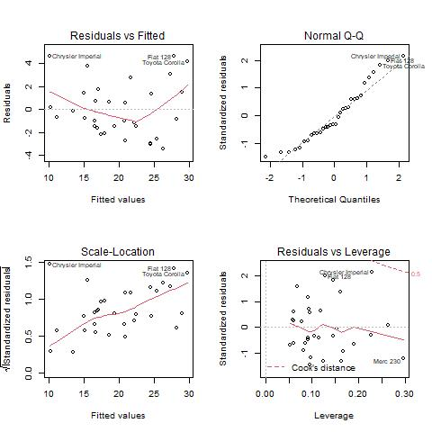

```{r setup, include=FALSE}
library(datasets)
library(dplyr)
library(ggplot2)
library(GGally)

knitr::opts_chunk$set(echo = FALSE)
```

## Summary 

In this document we will try to anwer the question of wich transmission type is better for fuel consumption in cars. It may seen like an easy question to answer, but it is not so simple. There are many variables that affect fuel consumption. Transmision type is a relevant variable, but not the only one. In this document we'll try to explain wich are the most influential variables and the numerical impact in fuel consumption in cars.


## Car Road Tests

The data was extracted from the 1974 Motor Trend US magazine, and comprises fuel consumption and 10 aspects of automobile design and performance for 32 automobiles (1973–74 models). You can see the full description and a summary of the data in **[Apendix A](# Apendix A)**.


## Wich type of transmission is better to fuel consumption?

The variable related to fuel consumption is (`mpg`). Let's 'see a boxplot with the `mpg` vs transmission type (`am`):


```{r BOX_PLOT, echo=FALSE, fig.align='center', fig.height= 2.5,fig.width= 2.5, fig.scap= "Boxplot mpg vs transmission type"}
my_cars <- mtcars %>% 
        mutate( mpg = mpg,
                   am = factor(am, labels = c("automatic","manual")),
                   vs = factor(vs, labels = c("v-shape","straight")))

my_cars %>% ggplot(aes(x = am, y = mpg)) +
        geom_boxplot() +
        geom_jitter(aes(color = am), size = 3, alpha = .35) +
        labs(x = "transmision type",
             y = "mpg")+
        theme(axis.text.x = element_text(
                angle = 0,
                size = 6,
                vjust = 0.5
        ),
        panel.background = element_rect(fill = "grey90"),
        panel.grid = element_line(color = "grey"),
        legend.position = "none"
        ) 
```

You can conclude that see transmision cars performs, in general, greater mpg. 
To check tha the difference is statistically significant, we make a `t.test`

```{r TEST}
my_test <- with(my_cars,t.test(mpg ~ am)) # test mpg vs transmisison type)
my_test
``` 

Looking for transmission type uniquelly, manual transmision has a better fuel consumptuion vs automatic, and the difference is significant (*p-value* = `r round(my_test$p.value,5)` < 0.05) and with a mean difference of `r round(my_test$estimate[2]-my_test$estimate[1],2)` miles per gallon.

In fact, the previous analysis is not complete. This is because there are many variables that affect on the `mpg` (see in [Apendix A](# Apendix A). If we fit a linear model to estimate mpg only from transmission type, you find that is explains a low variance.

```{r LM_AM, echo= TRUE} 
sum_fit_am <- summary(lm(mpg ~ am, data = my_cars))
sum_fit_am$coefficients
sum_fit_am$adj.r.squared
``` 

> `r round(sum_fit_am$adj.r.squared,3)` is a poor value of the We have to conclude than transmision type separatelly (`am` variable) is not enough to measure the difference in mpg

## Quantify impact of transmission type on fuel consumption

There are more variables that are relevant. In *Apendix A - Model Selection* we try different models  to select the best balance (that is: maximize adjusted $R^2$ with the least estimated error in the model coefficients and normality of residuals). The result is the model that includes transmission type (am), the weight (wt) and the time to run 1 1/4 miles (qsec).

```{r BEST_FIT,echo=FALSE}
sum_fit_3<- summary(lm(mpg ~ am + wt + qsec, data = my_cars))
sum_fit_3
```

> This model, can explain over 83% of variance of mpg. You can see that am has a positive coefficient, so manual tranmision increases mpg in `r sum_fit_3$coefficients[2,1]` that is significantly lower than the first calculus with only transmission type.


# Apendix A

## Structure of `mtcars` data frame

`mtcars` is a data frame with 32 observations on 11 variables. Next you hava the description

| # |  Var  | Type    | Description     |
|:-:|:-----:|:-------:|:---------------|
| 1 | `mpg` | Numeric | Miles/(US) gallon |
| 2 | `cyl` | Numeric | Number of cylinders |
| 3 |`disp` | Numeric | Displacement (cu.in.) |
| 4 | `hp` | Numeric | Gross horsepower |
| 5 | `drat` | Numeric | Rear axle ratio |
| 6 | `wt` | Numeric | Weight (1000 lbs) |
| 7 | `qsec` | Numeric | 1 1/4 mile time |
| 8 | `vs` | Factor | Engine (0 = V-shaped, 1 = straight) |
| 9 | `am` | Factor | Transmission (0 = automatic, 1 = manual) |
| 10 | `gear` | Numeric | Number of forward gears |
| 11 | `carb` | Numeric | Number of carburetors |

## Summary of data

Next you have a summary of the dataset:

```{r SUMM_CARS, echo=FALSE}
#basic transformation
my_cars <- mtcars %>% 
        mutate( mpg = mpg,
                   am = factor(am, labels = c("manual","automatic")),
                   vs = factor(vs, labels = c("V","S")))

summary(my_cars)
```

For each numeric variable, the summary shows the minimum, maximum, mean, 1st Quantile (lowest 25%), median (sorted 50%) and 3rd Quantile (top 25%).
For each Factor variable you'll  find the numer of observations of each level.

## Pair analysis

Next you can see a matrix graphic that shows pair relation between variables. 

```{r PAIR_CARS, echo=FALSE, message=FALSE, warning=FALSE, fig.height=5, fig.width=6, fig.cap= "Pair relations - mtcars"}
ggpairs(
        my_cars,
        lower = list(continuous = "smooth", size = 1,binwidth = .5),
        upper = list(continuous = wrap('cor', size = 2))) + 
        theme(axis.text = element_text(size = 5))
        
```

## Model selection

```{r ADJ_R_SQ}
fit_am <- lm(mpg ~ am, data = my_cars)
fit_all <- lm(mpg ~ ., data = my_cars)
fit_5 <- lm(mpg ~ am + wt + qsec + disp + hp , data = my_cars)
fit_4 <- lm(mpg ~ wt + qsec + disp + hp , data = my_cars)
fit_3 <- lm(mpg ~ am + wt + qsec, data = my_cars)
fit_2 <- lm(mpg ~ am + qsec, data = my_cars)

sum_fit_am <- summary(fit_am)
sum_fit_all <- summary(fit_all)
sum_fit_5 <- summary(fit_5)
sum_fit_4 <- summary(fit_4)
sum_fit_3 <- summary(fit_3)
sum_fit_2 <- summary(fit_2)

df_models <- data.frame(adj_r_squared = c(sum_fit_am$adj.r.squared,sum_fit_2$adj.r.squared,sum_fit_3$adj.r.squared,sum_fit_4$adj.r.squared,sum_fit_5$adj.r.squared,sum_fit_all$adj.r.squared),row.names=c(sum_fit_am$terms[[3]],sum_fit_2$terms[[3]],sum_fit_3$terms[[3]],sum_fit_4$terms[[3]],sum_fit_5$terms[[3]],sum_fit_all$terms[[3]]))
df_models <- df_models %>% arrange(desc(adj_r_squared))
df_models
```

With `am` we only explain 33% of variety. Including other predictors, we can achive over 83%, wich es much better. Now we check the estandar error of Coefficients for the TOP-3 $R^2$ models:

```{r ADJ_STD_ERR}
sum_fit_5$terms[[3]]
sum_fit_5$coefficients[,2]
sum_fit_3$terms[[3]]
sum_fit_3$coefficients[,2]
sum_fit_4$terms[[3]]
sum_fit_4$coefficients[,2]
```

The best balanced model would be the one with variables: am, wt and qsec. Lets check the residual plots

```{r SAVE_PLOTs, include=FALSE}
jpeg("graphs/Model_mpg_vs_cyl+disp+hp+drat+wt+qsec+vs+am+gear+carb.jpeg")
par(mfrow = c(2,2))
plot(fit_all)
dev.off()

jpeg("graphs/Model_mpg_vs_am+wt+qsec+disp+hp.jpeg")
par(mfrow = c(2,2))
plot(fit_5)
dev.off()

jpeg("graphs/Model_mpg_vs_wt+qsec+disp+hp.jpeg")
par(mfrow = c(2,2))
plot(fit_4)
dev.off()

jpeg("graphs/Model_mpg_vs_am+wt+qsec.jpeg")
par(mfrow = c(2,2))
plot(fit_3)
dev.off()

jpeg("graphs/Model_mpg_vs_am.jpeg")
par(mfrow = c(2,2))
plot(fit_am)
dev.off()
```


```{r PLOT4, fig.align= 'center', fig.height=4,fig.width=5, fig.cap="Model mpg vs am, wt and qsec"}

```
